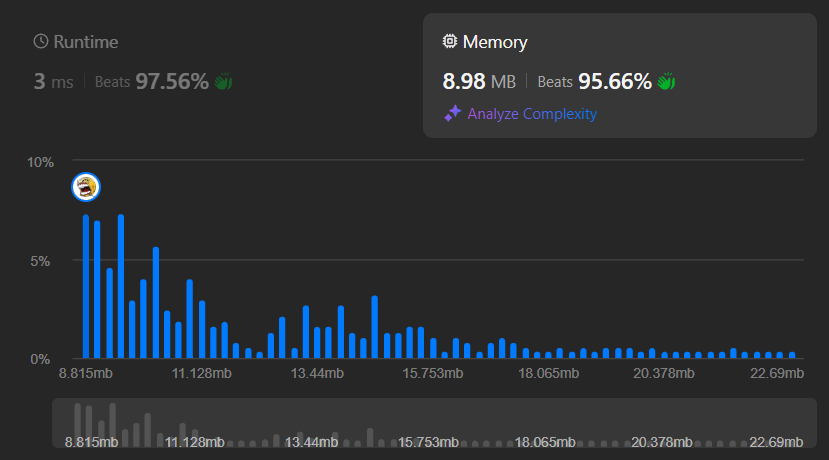

## L1.16

This Go snippet demonstrates an in-place quicksort implementation with optimizations for both pivot selection and recursion depth.

The sortArray function acts as the entry point, calling qSort with the full slice.

The qSort function uses a loop + recursion hybrid to reduce stack depth. After partitioning the slice around a pivot, it always recurses on the smaller subarray first, then continues iterating on the larger subarray in the loop. This approach prevents deep recursion on already large subarrays, which helps avoid stack overflow in worst-case scenarios.

The medianOfThree function selects the pivot as the median of the left, middle, and right elements. This improves performance on partially sorted arrays by reducing the likelihood of poor pivot choices.

The partition function rearranges elements in-place, moving all values less than or equal to the pivot to the left and larger values to the right. The pivot is finally placed in its correct position, and its index is returned for further recursive sorting.

Time Complexity O(N∗Log(N)) | Space Complexity O(Log(N))

