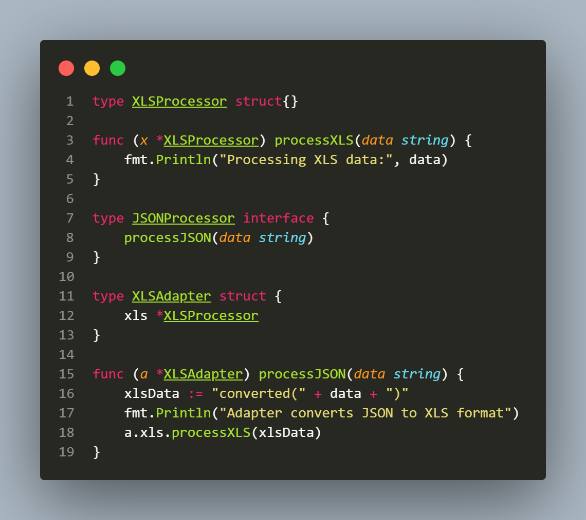

## L1.21

This Go snippet demonstrates the Adapter design pattern by bridging compatibility between old and new device interfaces. The program defines two interfaces: oldDevice, which connects through micro USB, and newDevice, which connects through type-C. Two concrete types implement these interfaces: oldPhone, which only has a micro USB port, and newPhone, which only has a type-C port. To make an old phone work where a type-C device is expected, an adapter type is introduced. The adapter wraps an oldDevice and implements the newDevice interface by internally calling the wrapped device’s connectMicroUSB method, simulating the conversion between standards.

The Adapter pattern is useful when different interfaces must work together, especially in legacy integration or when working with third-party libraries. Its advantages include reusability of existing code, flexibility in making incompatible systems cooperate, and encapsulation of conversion logic in one place. However, it can also add extra complexity and, in some cases, introduce minor performance overhead.

For example, in database connections, an adapter can expose a MySQL-like interface while internally using PostgreSQL drivers, avoiding a rewrite of existing data access logic. Similarly, in data processing, an adapter can convert between XLS and JSON formats so that existing XLS-based reporting code can be reused while still supporting modern JSON-based clients.

